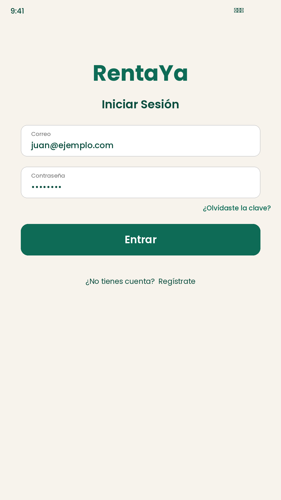
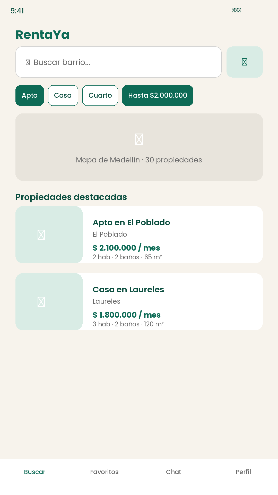
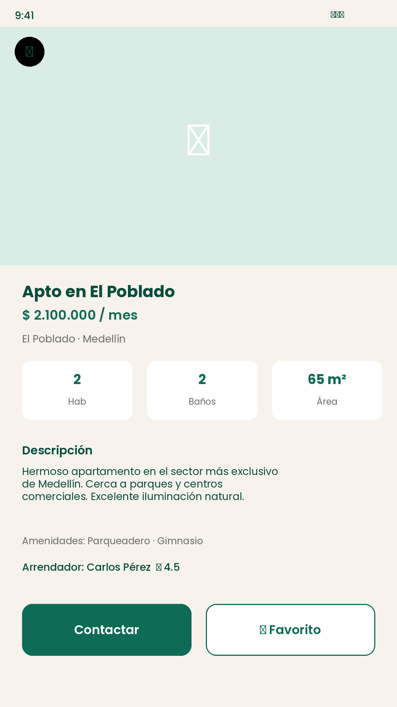
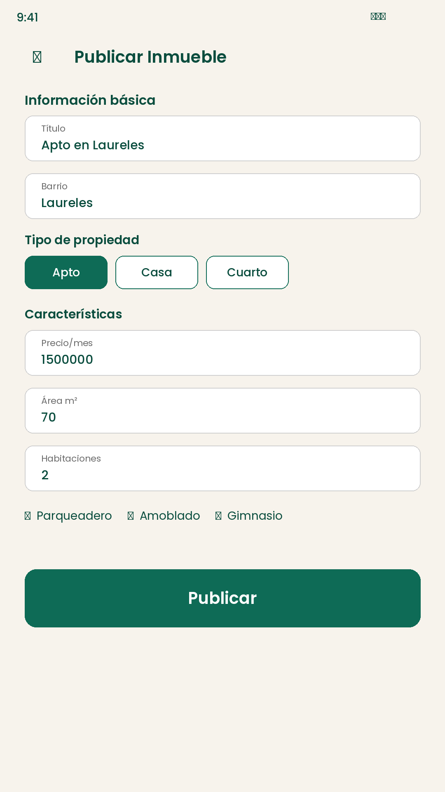

# RentaYa 🏠

**RentaYa** es una aplicación móvil nativa Android desarrollada con Kotlin y Jetpack Compose para buscar apartamentos, casas y cuartos en arriendo en Medellín, Colombia.

> **Proyecto Académico** - Entrega 3: Aplicación Móvil Nativa  
> Universidad Pontificia Bolivariana (UPB) - Curso de Aplicaciones Móviles  
> Versión: **1.0.2** · `applicationId`: `com.rentaya.rentola`

## 📱 Características

- ✅ **Autenticación**: Login y registro locales; Supabase Auth con las claves de `supabase.properties`
- 🔍 **Búsqueda y filtros**: Barrio, tipo, chip de **precio máximo**, habitaciones
- 🗺️ **Vista de mapa**: Mock estático de Medellín
- ❤️ **Favoritos**: IDs persistidos en **DataStore** + contador en la barra
- 💬 **Chat**: Conversación mock con arrendadores
- 📝 **Publicar inmueble**: Formulario que **persiste** vía `RepositorioPropiedades` (local + remoto)
- 🏠 **Mis publicaciones**: Lista de lo publicado en la sesión
- ⚙️ **Configuración / Acerca de / Créditos**
- 📴 **Offline por defecto**: Sin red o sin claves usa `SampleData` (**~30 propiedades**). Con Supabase, intenta remoto y cae a local si falla la red.

## 🏗️ Arquitectura

```
app/
├── data/
│   ├── model/                 # Property, User, Message, Landlord
│   ├── repositorio/           # RepositorioPropiedades, RepositorioUsuarios
│   ├── remoto/                # ClienteSupabase (REST + Auth HTTP)
│   ├── SampleData.kt          # Semillas locales (~30) + favoritos en memoria
│   └── UserPreferences.kt     # DataStore (sesión, tema, IDs favoritos)
├── ui/
│   ├── theme/                 # Material 3 (Cream + Green)
│   ├── screens/               # Pantallas Compose
│   └── navigation/            # NavHost y rutas
└── MainActivity.kt
```

### Capas

| Capa | Responsabilidad |
|------|-----------------|
| **UI (Compose)** | Pantallas, navegación, formularios |
| **Preferencias** | `UserPreferences` (DataStore) |
| **Repositorios** | Eligen remoto o local |
| **Remoto** | `ClienteSupabase` (OkHttp) |
| **Local** | `SampleData` + publicaciones de la sesión |

Las claves se leen de `supabase.properties` (y opcional override en `local.properties`) → `BuildConfig`.

### Navegación

- **Auth**: Onboarding → Login / Register  
- **Principal**: Buscar, Favoritos, Chat, Perfil  
- **Menú Perfil**: Publicar, **Mis publicaciones**, Configuración, Créditos  

## 🚀 Cómo ejecutar

1. Clona y abre la carpeta en **Android Studio** (JDK 17 o 21).  
2. Sync Gradle — `supabase.properties` ya trae URL y clave anon.  
3. Emulador o celular con depuración USB → Run 'app'.  

Detalle: [`docs/supabase/CONFIGURAR.md`](docs/supabase/CONFIGURAR.md).

```bash
./gradlew assembleDebug
./gradlew bundleRelease   # requiere keystore.properties local
```

## 🎨 Diseño

- **Manuales**: [`docs/wireframes/manuales/wireframes-manuales-rentaya.pdf`](docs/wireframes/manuales/wireframes-manuales-rentaya.pdf)
- **Figma**: [Soluciones parchadas](https://www.figma.com/design/6IKRsM1DLKdmIa6J7ZciIO/Soluciones-parchadas)
- Paleta: Cream `#F7F3EC` · Green `#0E6B56` · Dark Green `#0A4D3E`

### Capturas

<p align="center">
  
  
  
  
</p>

## 🗂️ Datos de ejemplo

**~30 propiedades** (semilla base + aportes de Steve y Mariana): El Poblado, Laureles, Aranjuez, Manrique, Robledo, Bello, Itagüí, etc.  
SQL: [`docs/supabase/esquema.sql`](docs/supabase/esquema.sql), [`semillas_steve.sql`](docs/supabase/semillas_steve.sql), [`semillas_mariana.sql`](docs/supabase/semillas_mariana.sql).

## 🔐 Privacidad

- Local: DataStore + memoria.  
- Con Supabase: cuenta y propiedades en el proyecto remoto.  

- Archivo: [`docs/privacidad.html`](docs/privacidad.html)  
- **URL pública:** https://juanval0308.github.io/RentaYA/privacidad.html  

## 👥 Equipo

| Integrante | Rol | Notas |
|------------|-----|-------|
| **Juan Pablo Martinez Romero** | Desarrollador principal | Infra, Supabase, Play, docs |
| **Steve** (Zteve0) | Desarrollador | Completo en funcionalidad base; ver commits restantes en `TAREAS_EQUIPO.md` |
| **Mariana Osorio** | Ingeniera | Publicar, Mis publicaciones, favoritos DataStore — **completo** |

## 📦 Publicación en Google Play

- **Cuenta:** `juanpa.martinezro@gmail.com`  
- **Estado:** AAB **1.0.2** (versionCode 3) listo para **prueba interna**; enlace de ficha pendiente de pegar tras liberar en Console.  
- **Enlace:** _[completar URL de Play / Internal testing]_  
- Package: `com.rentaya.rentola` · Nombre: **RentaYa**

## 📱 Prueba en dispositivo físico

Checklist y plantilla: [`docs/prueba-dispositivo/README.md`](docs/prueba-dispositivo/README.md)  
(Pendiente: foto del celular del equipo.)

## 📑 Presentación

- Guion: [`docs/presentacion/ENTREGA3.md`](docs/presentacion/ENTREGA3.md)  
- One-pager: [`docs/presentacion/index.html`](docs/presentacion/index.html)

## 📝 Tareas del equipo

Ver [`TAREAS_EQUIPO.md`](TAREAS_EQUIPO.md).

## 📄 Licencia

MIT — fines educativos (UPB 2026).

## 📞 Contacto

- https://github.com/JuanVal0308/RentaYA  

---

<p align="center">Desarrollado para el curso de Aplicaciones Móviles — UPB 2026</p>
